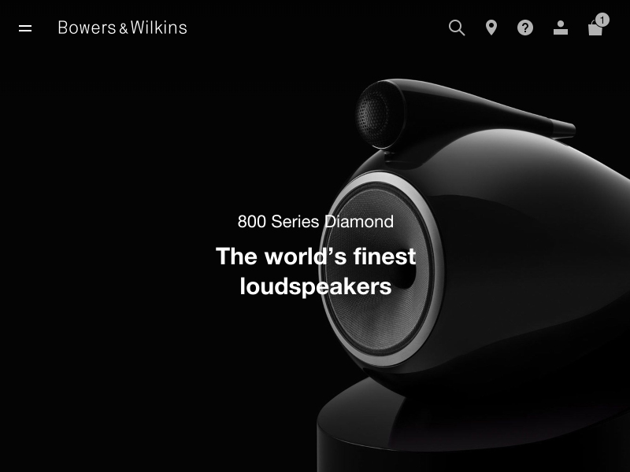

Magento was used in a partially headless mode together with Drupal to create a fast site with vast amounts of content, particularly high res imagery of Bowers & Wilkins products.

## References

* [Human Element Launches Headless Magento Website for Bowers & Wilkins](https://www.human-element.com/human-element-launches-bowers-wilkins-magento-website/)

## Preview

