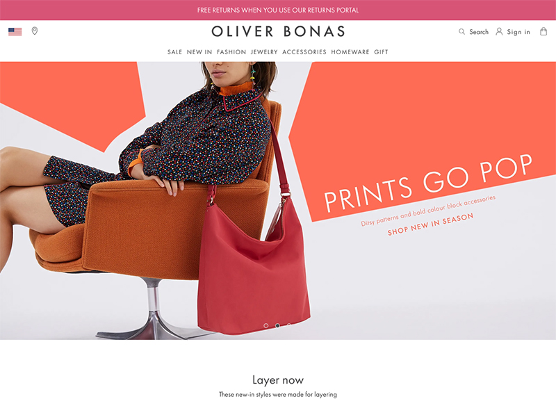

As part of their replatforming effort (moving from Magento 1 to Magento 2), Oliver Bonas launched an Angular.js powered front-end together with a headless Magento 2 backend.

## References

* [What is Oliver Bonas’s headless e-commerce approach?](https://www.retailconnections.co.uk/articles/oliver-bonas-headless-e-commerce/)

## Preview

