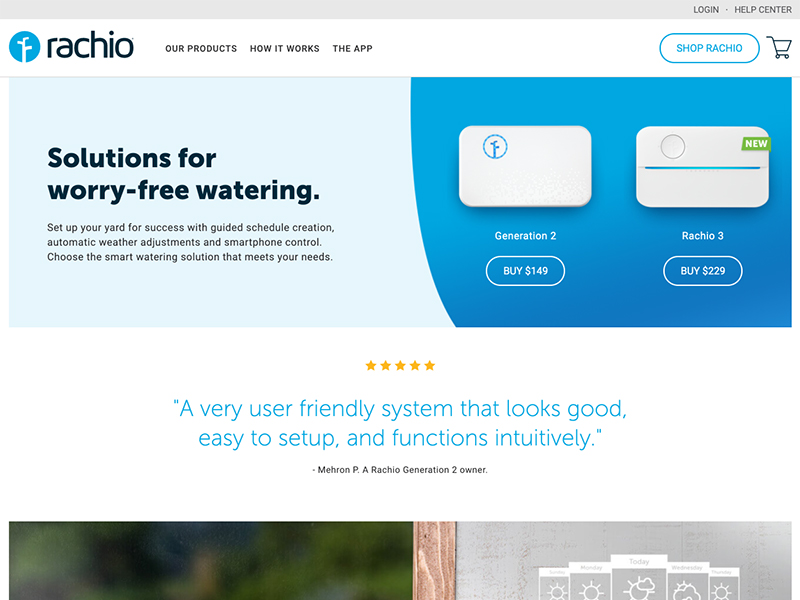

The Shopify cart + checkout were used in combination with a headless product catalog fed from Shopify's APIs and a blazing fast front-end built with Gatsby.

## References

* [GatsbyJS — building fast modern websites with React Kyle Mathews (@kylemathews)](https://www.youtube.com/watch?v=-EftEYczRVI)

## Preview

